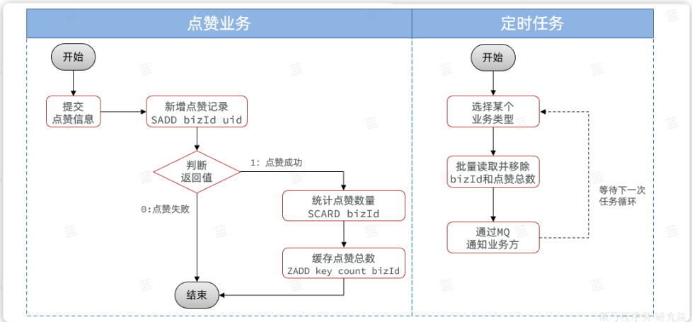
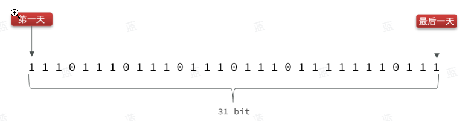
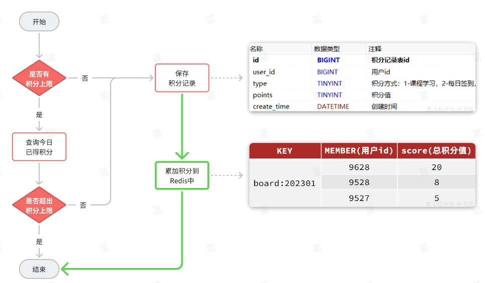
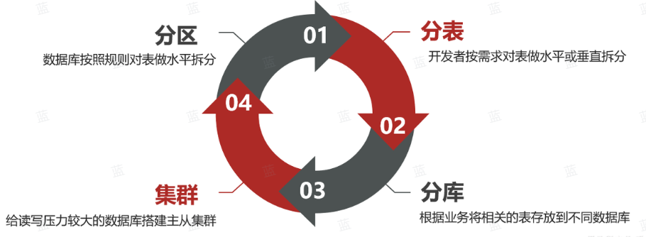
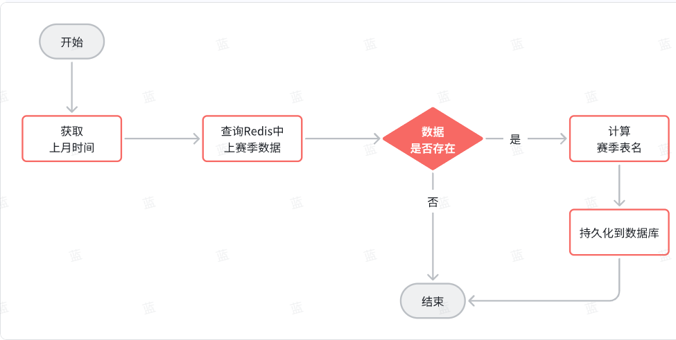
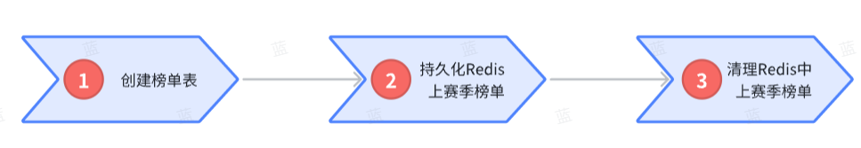
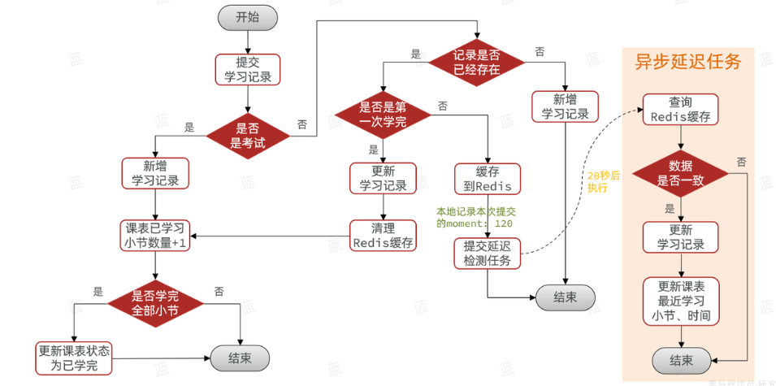

# 热海大学堂个人开发部分
# 前言
> 本仓库为Gogs私服克隆仓库，代码为本人编写的问答系统功能、赛季排行榜功能、点赞功能、视频播放进度回放功能
> 四部分核心代码，其余代码为项目初始代码

> 本仓库仅仅用于介绍本人负责模块的源码，不提供其他任何支持，已编写功能可用Swagger进行测试。

# 项目介绍
#### 热海大学堂项目致力于打造一个校园课程录播学习系统，提供丰富的学习辅助功能和交互功能，模拟游戏系统打造学习积分赛季排行榜功能包括用户管理模块，课表模块， 学习计划与进度模块，问答系统，点赞功能，积分排行榜功能等，以此提高用户参与度。
#### 项目通过 jmeter 进行压测来模拟高并发环境，服务在平均 1 万 QPS 下正常运行。
### 组织结构

``` lua
ReHaiDaXueTang
├── tj-api -- Feign接口公共包
├── tj-auth -- 杈限微服务
├── tj-common -- 通用工具包
├── tj-course -- 课程服务
├── tj-exam -- 考试服务
├── tj-gateway -- 网关服务
├── tj-learning -- 学习中心服务
├── tj-pay -- 支付服务
├── tj-remark -- 点赞服务
├── tj-trade -- 交易服务
└──  tj-user -- 用户服务
```

### 技术选型

#### 后端技术

| 技术            | 说明            | 官网                                                                            |
|---------------|---------------|-------------------------------------------------------------------------------|
| SpringBoot    | Web应用开发框架     | https://spring.io/projects/spring-boot                                        |
| MyBatis-plus  | 数据层代码生成器      | https://baomidou.com/                                                         |
| Elasticsearch | 搜索引擎          | https://github.com/elastic/elasticsearch                                      |
| RabbitMQ      | 消息队列          | https://www.rabbitmq.com/                                                     |
| Redis         | 内存数据存储        | https://redis.io/                                                             |
| Nacos         | 服务注册中心        | https://nacos.io/zh-cn/docs/quick-start.html                                  |
| Seata         | 分布式事务处理框架     | https://seata.apache.org/zh-cn/                                               |
| Sentinel      | 微服务保护技术       | https://sca.aliyun.com/zh-cn/docs/2022.0.0.0/user-guide/sentinel/quick-start/ |
| OpenFeign     | Web服务客户端      | https://spring.io/projects/spring-cloud-openfeign/                            |
| XXL-JOB       | 分布式任务调度中心     | https://www.xuxueli.com/xxl-job/                                              |
| Nginx         | 静态资源服务器       | https://www.nginx.com/                                                        |
| Docker        | 应用容器引擎        | https://www.docker.com                                                        |
| Jenkins       | 自动化部署工具       | https://github.com/jenkinsci/jenkins                                          |
| OSS           | 对象存储          | https://github.com/aliyun/aliyun-oss-java-sdk                                 |
| JWT           | JWT登录支持       | https://github.com/jwtk/jjwt                                                  |
| Lombok        | Java语言增强库     | https://github.com/rzwitserloot/lombok                                        |
| Hutool        | Java工具类库      | https://github.com/looly/hutool                                               |
| PageHelper    | MyBatis物理分页插件 | http://git.oschina.net/free/Mybatis_PageHelper                                |
| Swagger       | API文档生成工具     | https://github.com/swagger-api                                                |

## 一、点赞功能（tj-remark）
### 1.点赞/取消赞（LikedRecordController）
#### 实现简介
从后台实现来看，点赞就是新增一条点赞记录，取消就是删除这条记录。为了方便前端交互，这两个合并为一个接口。 
#### 流程图

### 2.批量查询点赞状态（LikedRecordController）
Redis中提供了一个功能Pipeline，可以在一次请求中执行多个命令，实现批处理效果。
```shell
# 判断用户是否点赞(一个用户对某一个业务)使用用管道技术减少TTL
SISMEMBER bizId userId
```
## 二、积分、赛季排行榜功能（tj-learning）
### 1.签到功能（SignRecordController）
#### Redis-BitMap数据结构实现（只需要31位就能记录一个用户一个月签到情况）

### 2.当前赛季排行榜（LikedRecordController）
#### Redis-SortedSet实现
Redis的SortedSet底层采用了跳表的数据结构，因此可以非常高效的实现排序功能，百万用户排序轻松搞定。而且每当用户积分发生变更时，我们可以实时更新Redis中的用户积分，而SortedSet也会实时更新排名。实现起来简单、高效，实时性也非常好。缺点就是需要一直占用Redis的内存，当用户量达到数千万时，性能有一定的下降。

### 3.历史赛季排行榜（LikedRecordController）
#### 海量数据存储策略

#### MySQL水平分表与xxl-Job分布式任务实现
按照赛季拆分，每一个赛季是一个独立的表；使用Mybatis-Plus动态表名插件

三个任务实现

## 三、视频播放进度功能（tj-learning）
### 1.播放进度记录方案改进（LearningRecordServiceImpl）

## 四、问答系统（tj-learning）
简单CUDR编写，详细代码为

InteractionQuestionController（用户端）

InteractionQuestionAdminController（管理端）
